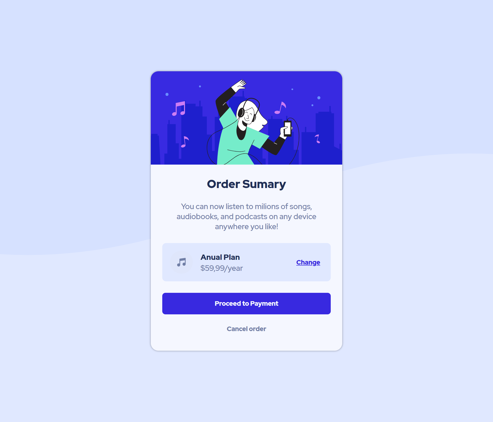

Click on the screenshot image to access the project.

## Projects

### Order Summary Card

This is a solution to the [Order summary card challenge on Frontend Mentor](https://www.frontendmentor.io/challenges/order-summary-component-QlPmajDUj).
It consists of an implentation of a Order Summary Card following with the intention of replicate the designs provided by the challenge. Even though being
a simple challange, it helped to pratice _FlexBox_ layout and _Mobile First_ apporach.

- Link to the code: [Github repo](https://github.com/guilhermespopolin/portifolio/tree/main/order-summary-card)
