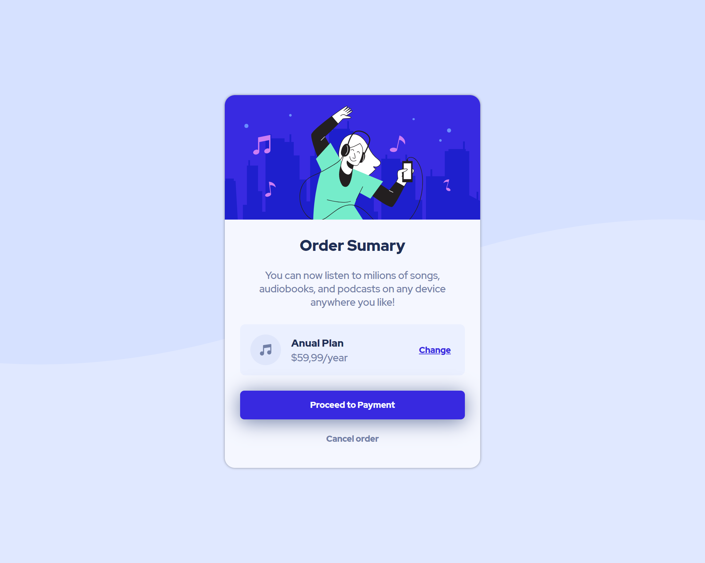
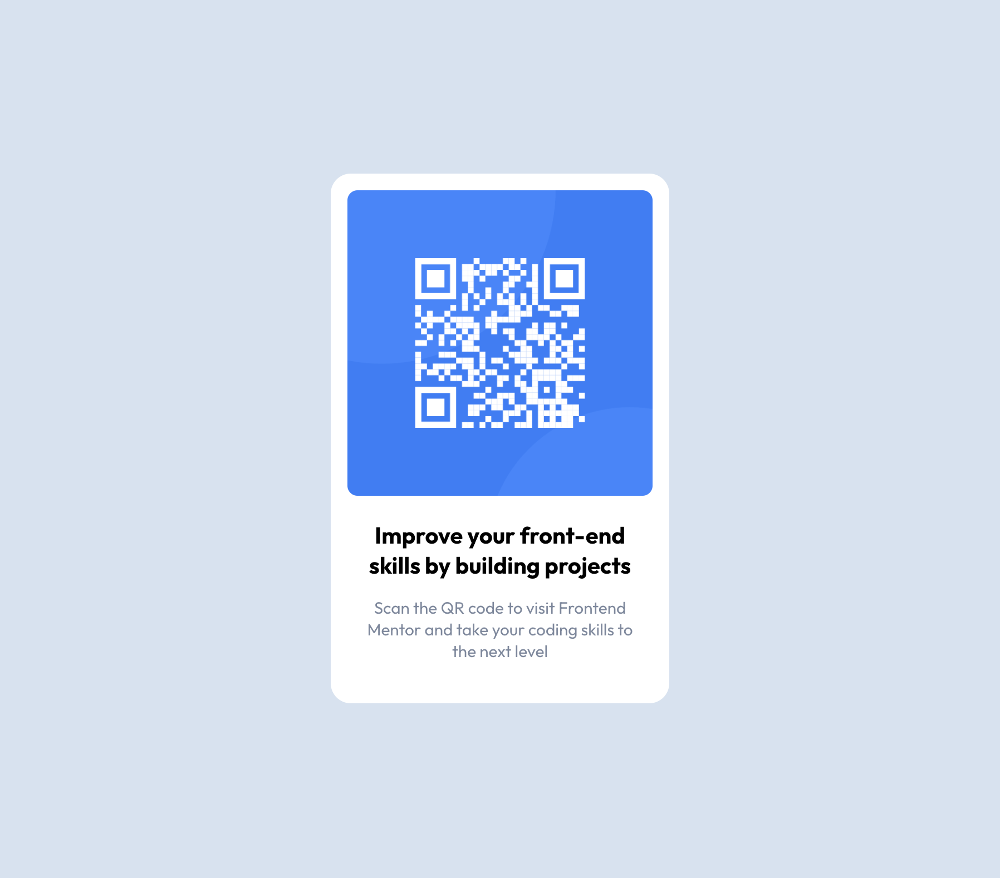
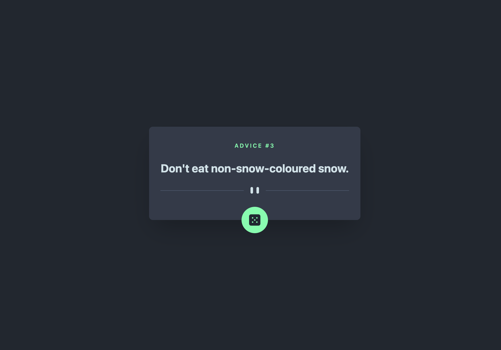

Click on the screenshot image to access the project.

## Projects

### Order Summary Card

This is a solution to the [Order summary card challenge on Frontend Mentor](https://www.frontendmentor.io/challenges/order-summary-component-QlPmajDUj).
It consists of an implentation of a Order Summary Card with the intention of replicate the designs provided by the challenge. Even though being
a simple challange, it helped to pratice _FlexBox_ layout and _Mobile First_ apporach.

- [Github repo](https://github.com/guilhermespopolin/portifolio/tree/main/projects/order-summary-card)

### QR Code Card

This is a solution to the [QR Code Card challenge on Frontend Mentor](https://www.frontendmentor.io/challenges/qr-code-component-iux_sIO_H/hub/qr-code-component-qOZzN4RgzP).
It consists of an implentation of a QR Code Card with the intention of replicate the designs provided by the challenge. Even though being
a simple challange, it helped to pratice _FlexBox_ layout and _Mobile First_ apporach.

- [Github repo](https://github.com/guilhermespopolin/portifolio/tree/main/projects/qr-code-card)

### Advice Generator

This is a solution to the [Advice Generator challenge on Frontend Mentor](https://www.frontendmentor.io/challenges/advice-generator-app-QdUG-13db/hub/advice-generator-app-5DJeC7ZO9P).
It consists on a very simple app that requests random advices from an [API](https://api.adviceslip.com/) and display them. Even though very simple, the idea was to getting to know
[Remix](https://remix.run/) and [Tailwincss](https://tailwindcss.com/) frameworks.

- [Github repo](https://github.com/guilhermespopolin/portifolio/tree/main/projects/advice-generator)
